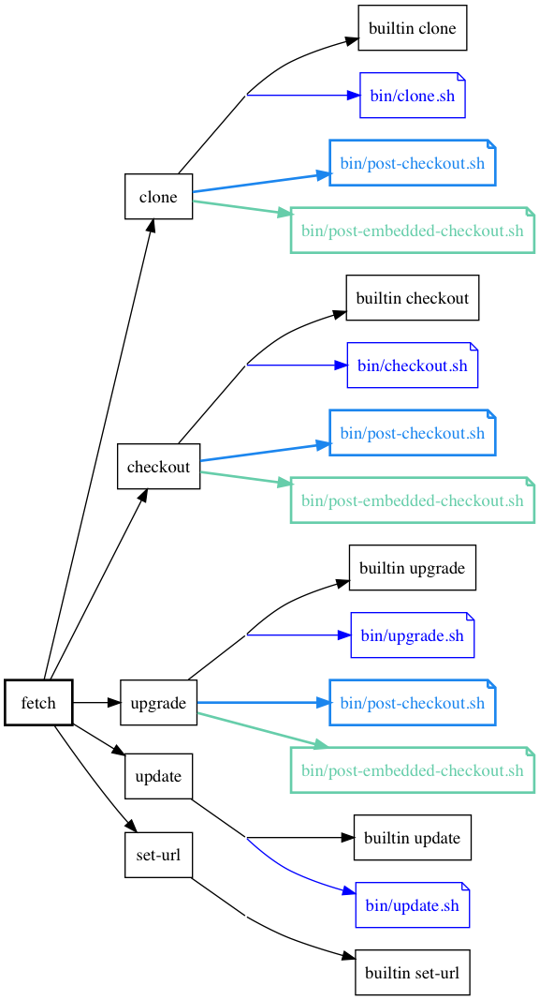

## Fetch

During the fetch phase, mulle-bootstrap does one ore more of the following
operations:

Operation | Git Equivalent | Description
----------|----------------|----------------------------
clone     | git clone      | A new entry or changes in the source prompt a clone
checkout  | git checkout   | Changes of the tag prompt a checkout
upgrade   | git pull       | Changes in branch information trigger an upgrade
set-url   | git set-url    | Changes in the URL with the same source may be handled with set-url

For many sources, any change will just trigger a removal of the old contents
and a fresh clone. In terms of "tar" as a source, that means refetching of the
archive and unpacking.

## Update/Upgrade

You can manually trigger the following actions

Operation | Git Equivalent | Description
----------|----------------|------------------------------
update    | git fetch      | Fetch new repository information, but don't check it out
upgrade   | git pull       | Pull new repository information

## Scripts used

Though all operations have builtin functions, each operation can be overridden
on a per-dependency basis with a script. After each operation is run (script
or built-in) a post-script will be triggered.

There are different post-scripts for embedded and regular repositories.

