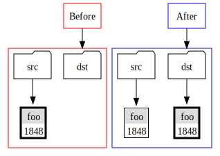
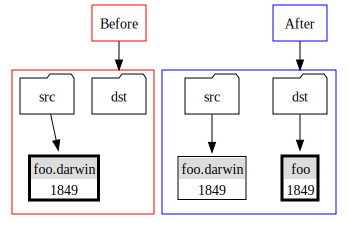
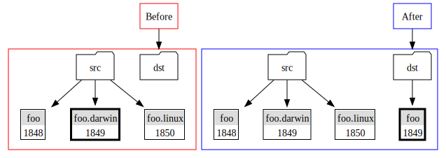
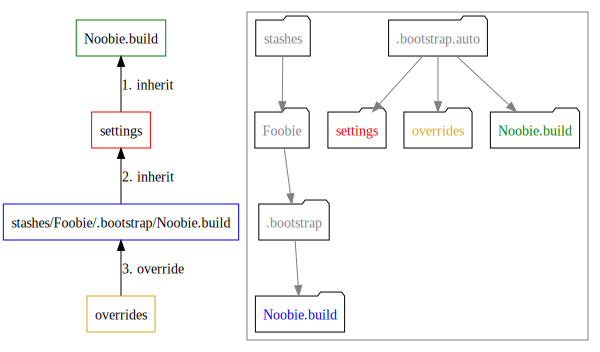
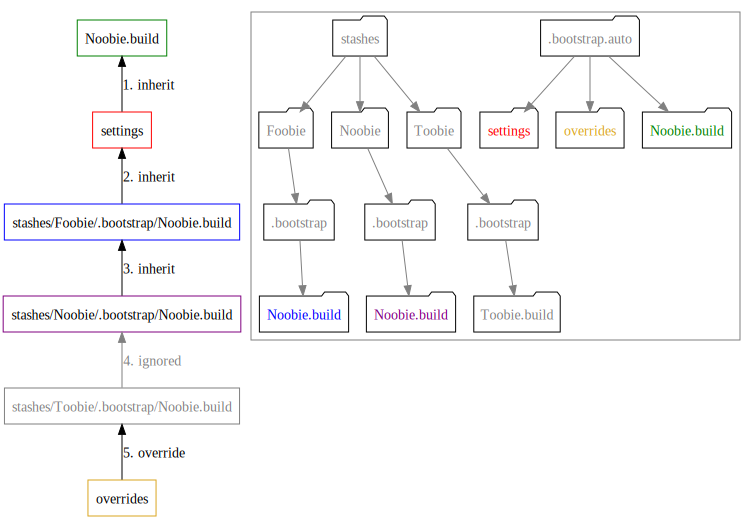

## Build Settings

A setting is generally stored as a file somewhere in the `.bootstrap` folder hierarchy. The filename is the **name** of the setting. The file contents are the **value** of the setting.

The settings inside `.build` folders are called build settings. A build setting can be a generic setting (no extension), or an os-specific setting. The os-specific settings have an extension, that is the simplified **uname** of the platform. Known values are

uname   | OS
--------|----
darwin  | OS X
linux   | Linux
freebsd | FreeBSD
mingw   | MinGW on Windows

> ## Important
> In these examples it is assumed that you are on "OS X", whose simplified
> **uname** is `darwin`

### How copying works

Asssume you have an empty folder `dst` and a folder `src` containing a setting. You want to copy a setting from `src` to `dst`.

#### Copy a generic setting

Just a straight copy of `foo`.

#### Copy a matching os-specific setting

Copy `foo.darwin` with extension removed into `dst`.

#### Copy a mismatch os-specific setting

Nothing matches for extension `.darwin` or no extension, so nothing is copied.

#### Copy from a set of generic and os-specific settings

`foo.darwin` is the best match so it is copied to `dst` as `foo`. The other files are ignored.

### Inheriting and Overriding settings

So far we have seen what happens when `dst` is empty. But what if there is already content ?

**mulle-bootstrap** simplifies the scenario, by first applying the above operations for `src` and `dst`. That means all the os-specific settings will be turned into generic settings, and the os-specific settings are removed.

> **mulle-bootstrap** uses temporary folders for this simplification

Then the scenario reduces to the following table for the operations **inherit** and **override**:

 dst      | override | inherit
----------|----------|------------------
 empty    | copy     | skip
 occupied | copy     | copy

## So where do the .build settings actually come from ?

Remember that the contents of `.bootstrap.auto` are created by copying `.bootstrap.auto` and `.bootstrap.local`. Then other settings are **inherited** or **overridden** as shown on the pictures. The left diagram shows the order of steps. The right diagram gives a view on the filesystem:

> #### Stopping the inheritance
>
> If you want to stop the inheritance at some point, place a setting `final` with value "YES"
> inside the `.bootstrap/<repository>.build` folder.
> **overrides** will still be applied though, if  `final` is set in a repository folder
> (blue).
>

Imagine that you have a more complicated setup, with "Foobie" depending on "Noobie" and "Noobie" depending on "Toobie".

| repositories |
|--------------|
| Toobie       |
| Noobie       |
| Foobie       |

Each repository contains it's own `Noobie.build` folder. What happens ?

The `Noobie.build` folders are inherited in reverse order of `repositories`. So "Foobie"(blue) comes first, then "Noobie" (purple). As with "Noobie" the folder name matches the repository name, the inheritance will skips all remaining repositories.

> ### Reminder
>
> Use these features sparingly.
> Generally, the fewer build settings you use, the more flexible you stay.
>
