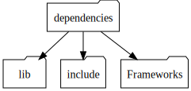
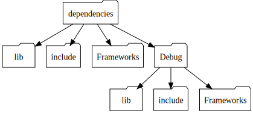
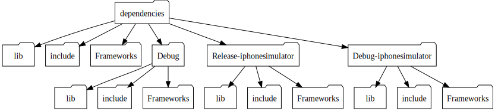

# dispense_style

`mulle-bootstrap config "dipense_style" <style>`

The default is `none`.

### `none`

Everything is dispensed into the `dependencies` root, possibly overwriting previous results from other configurations and sdks:




### `auto`

Auto selects either `configuration` or `configuration-sdk` based on the following rules:

1. If there is more than one **sdk** choose `configuration-sdk`
2. Otherwise choose `configuration`

> It is suggested to use `auto`, if you don't need separate sdks and do not need
> parallel installations of debug and release binaries.

### `configuration`

"Release" configuration products are dispensed into the `dependencies` root. Every other configuration is placed into its own subdirectory of the same name. Multiple sdks will overwrite each other:




### `configuration-sdk`

If the sdk is "Default" and the configuration is "Release", then everything is placed into the root directory. If the sdk is "Default", the configuration is placed into its own subdirectory of the same name. Otherwise every configuration/sdk pair is dispensed into its own subdirectory:




### `configuration-strict`


Every configuration is placed into its own subdirectory of the same name. Multiple sdks will overwrite each other:


### `configuration-sdk-strict`

Every configuration/sdk pair is dispensed into its own subdirectory:


## Xcode tip for `auto`


Set LIBRARY_SEARCH_PATHS like this:

```
LIBRARY_SEARCH_PATHS = $(DEPENDENCIES_DIR)/$(CONFIGURATION)$(EFFECTIVE_PLATFORM_NAME)/lib $(DEPENDENCIES_DIR)/$(CONFIGURATION)/lib $(DEPENDENCIES_DIR)/lib $(inherited)
```


Set FRAMEWORK_SEARCH_PATHS like this:

```
FRAMEWORK_SEARCH_PATHS = $(DEPENDENCIES_DIR)/$(CONFIGURATION)$(EFFECTIVE_PLATFORM_NAME)/Frameworks $(DEPENDENCIES_DIR)/$(CONFIGURATION)/Frameworks $(DEPENDENCIES_DIR)/Frameworks $(inherited)
```
