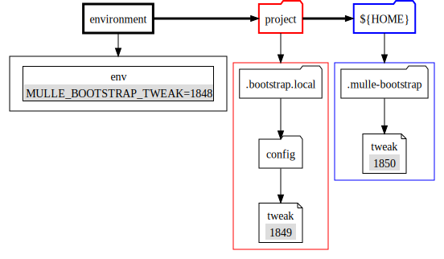
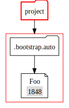
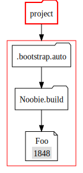

# Understanding Settings

## Setting Types and Search Paths

There are three different kinds of settings **mulle-bootstrap**.

### 1. Config Settings

These are settings that are typically read at the beginning of **mulle-bootstrap** and tweak some behaviour. They are rarely changed.

The search path for config variables and how they are stored is shown in the next picture. Assume that you are looking for a config setting "Tweak" (notice the capitalization):

First "Tweak" is transformed to "TWEAK" then "MULLE_BOOTSTRAP_" is prepended and the resulting string is searched in the environment. It would match and therefore return it's value `1848`.

If the environment does not yield a result, the search continues in `.bootstrap.local`. `Tweak` is now made lowercase and a file named `.bootstrap.local/config/tweak` is searched. If yes, the contents of this file `1849` is the result (minus '#' comments and empty lines).

If there was no file, the search would conclude by searchin `~/.mulle-bootstrap`.

If nothing is found, a built in default is used.

### 2. Root Settings

During all operatios execept **mulle-bootstrap build**, **mulle-bootstrap** will consult only roots settings, which reside in the `.bootstrap.auto` folder at top level. Assume that you are looking for a fetch setting "Foo":

If nothing is found, a built-in default is used.

### 3. Build Settings

Build settings are consulted exclusively during **mulle-bootstrap build**. Assume that you are looking for a build setting "Foo" during the build of a repository "Noobie":

If nothing is found, a built in default is used.

