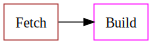
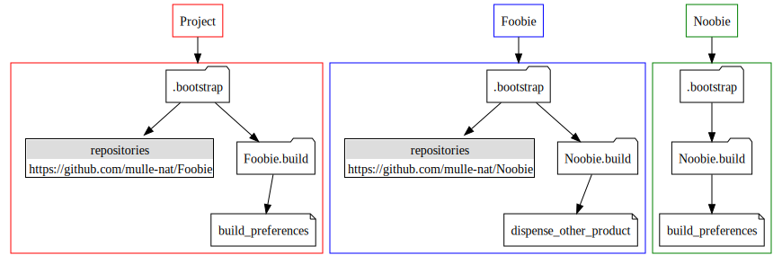
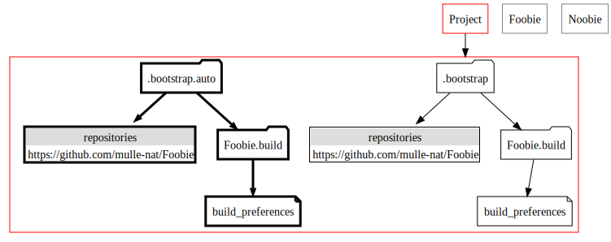
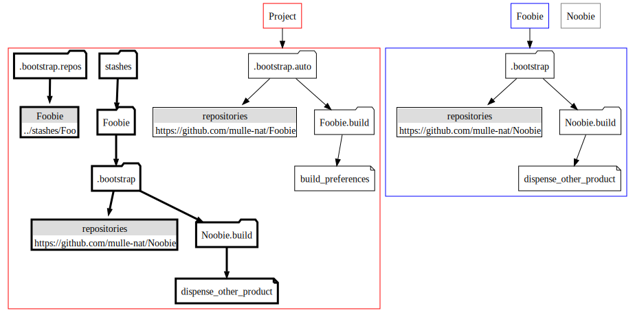
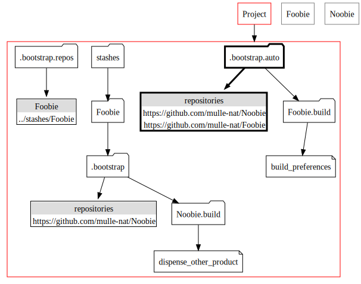
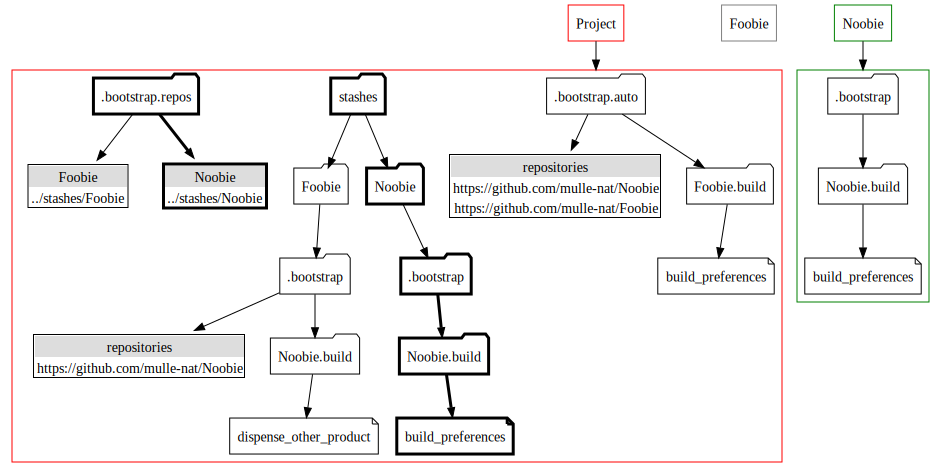
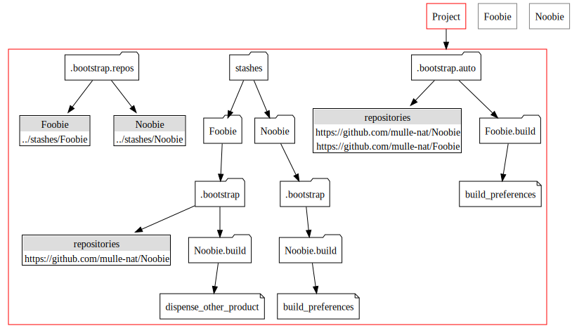
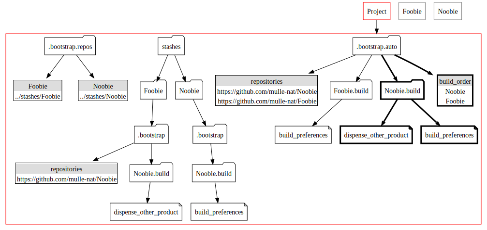
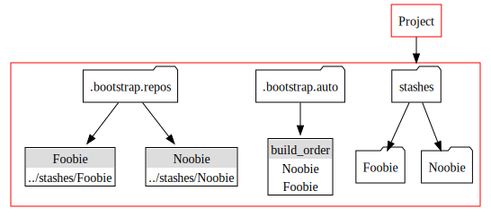

<!-- [comment]: <> (DO NOT EDIT THIS FILE. EDIT THE TEMPLATE "templates/dox/steps/FETCH.md.scion") -->
# Fetch and Build

At it's core mulle-bootstrap does two things Fetching and Building. This
article deals mainly with the **Fetch** aspect.



## The Scenario

You experiment with adding "Foobie" as a dependency to your "Project". "Foobie"
has a dependency on "Noobie". It doesn't really matter if you may or may not
know about this dependency, as you will see shortly:



You initialize your repository with `mulle-bootstrap init`, which will
create the `.bootstrap` folder for you. Then you place the dependency URL
`https://github.com/mulle-nat/Foobie` into the file `.bootstrap/repositories`.

```console
mulle-bootstrap init -n
echo "https://github.com/mulle-nat/Foobie" > .bootstrap/repositories
```

You also notice that "Foobie" can be built with either **cmake** or
**xcodebuild**. You prefer to use **xcodebuild** for some reason. So you
declare this in the `build_preferences` for "Foobie".

> Build options are put into a folder with the name of the repository with a
> `.build` extension.

```console
mkdir .bootstrap/Foobie.build
echo "xcodebuild" > .bootstrap/Foobie.build/build_preferences
```


## The Fetch

### 1. Recreate `.bootstrap.auto`

When executing a fetch, **mulle-bootstrap** first trashes any previously
generated `.bootstrap.auto` folder. Then it generates a new one.



The contents of `.bootstrap.auto` are combination of a `.bootstap.local` folder
and your `.bootstrap` folder. The preference is for `.bootstrap.local`
contents. But since there is no `.bootstap.local` here, `.bootstrap.auto` is a
simple copy of `.bootstrap`.

> Ref: [`bootstrap_auto_create`](https://github.com/mulle-nat/mulle-bootstrap/blob/release/src/mulle-bootstrap-auto-update.sh#L214)

From now `.bootstrap` is no longer used.

> #### Tidbit
>
>  **mulle-bootstrap init** is the only command that modifies `.bootstrap`.
>  **mulle-bootstrap config** is the only command that modifies
`.bootstrap.local`.


### 2. Fetch

The repositiories listed in `.bootstrap.auto/repositories` are cloned into a
`stashes` folder (`.repos` in mulle-bootstrap versions < 3.0).



Notice that `Foobie` brought along it's own `.bootstrap` folder. It contains
its own dependencies.

Also **mulle-bootstrap** created  (new in 3.0) a `.bootstrap.repos` folder. It
memorizes the place, where repositories have been fetched too.

> Ref: [`clone_repositories`](https://github.com/mulle-nat/mulle-bootstrap/blob/release/src/mulle-bootstrap-fetch.sh#L792)


### 3. Refresh

The refresh pass now picks up the `repositories` information from the
`stashes/Foobie/.bootstrap` folder and incorporates it into the projects
`.bootstrap.auto/repositories`.



Since Foobie depends on Noobie, it has been properly sorted on top of it.


> Ref: [`refresh_repositories`](https://github.com/mulle-nat/mulle-bootstrap/blob/release/src/mulle-bootstrap-refresh.sh#L447)


### 4. Fetch

Since the `.bootstrap.auto/repositories` has changed, a second fetch pass is
neccessary to clone the "Noobie" repository into `stashes`. :



As there is an existing clone of "Foobie" in `stashes`, it skips cloning "Foobie"
again.


### 5. Refresh

A second pass of refresh yields no changes to the `.bootstrap.auto/repositories`
file, so the fetch/refresh cycle is done:




### 6. Final

Since all repostiories listed in `.bootstrap.auto/repositories` haven been
fetched, it is now time to build the final `build_order`, which is just a
simplified list of the repositories in the proper order:



Also now the information from the folders
`./stashes/Noobie/.bootstrap/.Noobie.build` and
`./stashes/Foobie/.bootstrap/.Noobie.build` is almagamated into the
`./bootstrap.auto/Noobie.build`. How this is exactly done is shown elsewhere.


## The Build

The file `.bootstrap.auto/build_order` is consulted for the list and order of
the repositories to build:



Each name is used to lookup the location of the source to build via
`.bootstrap.repos`. So "Noobie" will find `../stashes/Noobie`.


What happens then hasn't changed much from earlier versions, so please read
[mulle-bootstrap: Understanding mulle-bootstrap](https://www.mulle-kybernetik.com/weblog/2016/mulle_bootstrap_how_it_works.html)
for more details on what the build step does.


